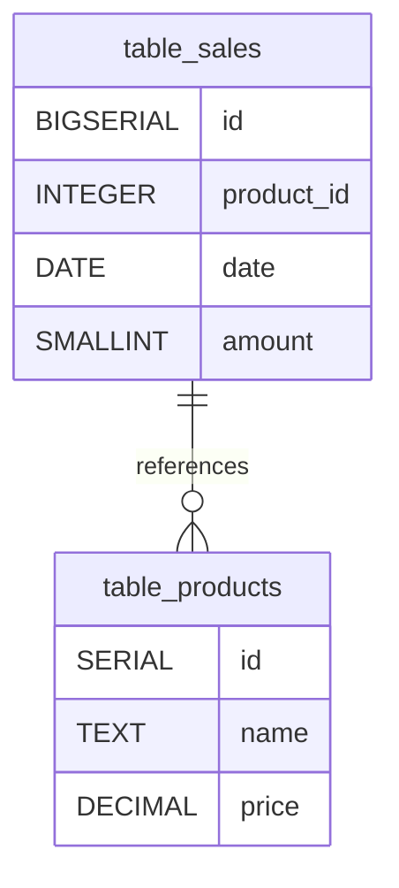

# Untitled Diagram documentation
## Summary

- [Introduction](#introduction)
- [Database Type](#database-type)
- [Table Structure](#table-structure)
    - [table_products](#table_products)
    - [table_sales](#table_sales)
- [Relationships](#relationships)
- [Database Diagram](#database-Diagram)

## Introduction

## Database type

- **Database system:** PostgreSQL
## Table structure

### table_products

| Name        | Type          | Settings                      | References                    | Note                           |
|-------------|---------------|-------------------------------|-------------------------------|--------------------------------|
| **id** | SERIAL | 🔑 PK, not null  |  | |
| **name** | TEXT | not null , unique |  | |
| **price** | DECIMAL | not null  |  | | 

### table_sales

| Name        | Type          | Settings                      | References                    | Note                           |
|-------------|---------------|-------------------------------|-------------------------------|--------------------------------|
| **id** | BIGSERIAL | 🔑 PK, not null  |  | |
| **product_id** | INTEGER | not null  | table_sales_product_id_fk | |
| **date** | DATE | not null , default: CURRENT_DATE |  | |
| **amount** | SMALLINT | not null , default: 1 |  | | 

## Relationships

- **table_sales to table_products**: many_to_one

## Database Diagram

